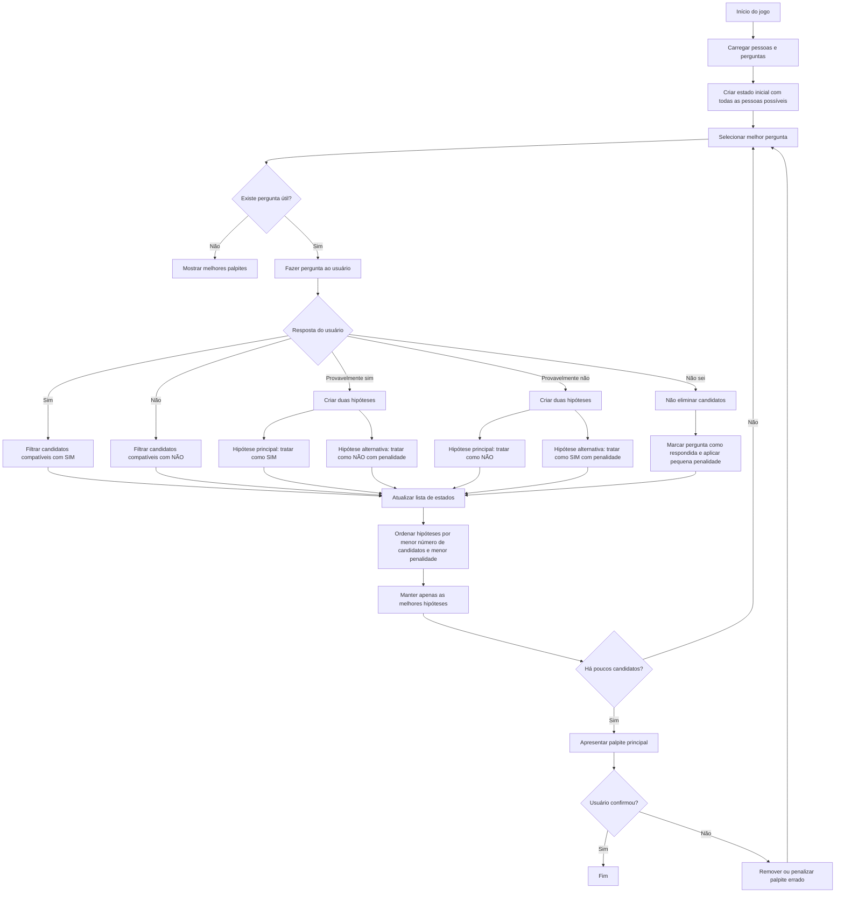

# Beam Search Decision Tree

**Autor:** Jefferson Rodrigo Speck  
**Disciplina:** Desenvolvimento Mobile

---

## Contexto pedagogico

Este projeto foi criado com dois propositos complementares.

O primeiro e servir como **material de apoio didatico**: o aplicativo torna visivel, em tempo real, como uma arvore de decisao se forma a partir das respostas do usuario. A cada rodada o aluno ve quais candidatos foram eliminados, quantas hipoteses paralelas o algoritmo manteve e por qual caminho a logica passou. O objetivo e tornar concreto um algoritmo que, em sala de aula, costuma ser apresentado apenas de forma abstrata.

O segundo e servir como **enunciado vivo de uma atividade avaliativa**. Os alunos do curso recebem como desafio construir seu proprio aplicativo do mesmo tipo, substituindo os dados de exemplo pelos professores reais do curso. Este projeto demonstra o que se espera do produto final e qual nivel de sofisticacao algorítmica e esperado.

---

## A atividade proposta aos alunos

### Descricao

Cada grupo devera desenvolver um aplicativo mobile no estilo Akinator cujo objetivo sera tentar descobrir qual professor do curso o usuario esta pensando. O app fara uma sequencia de perguntas e usara as respostas para conduzir a logica de decisao ate chegar a um palpite.

### Professores cadastrados obrigatoriamente

O aplicativo deve conter como hipoteses os seguintes professores do curso:

*Aqui os professores*.

### Respostas possiveis

O usuario deve poder responder cada pergunta com exatamente cinco opcoes:

- Sim
- Nao
- Nao sei
- Provavelmente sim
- Provavelmente nao

### Tipos de perguntas permitidas

As perguntas devem ser neutras, observaveis e respeitosas. Exemplos validos:

- usa oculos
- tem barba
- tem cabelo curto
- costuma usar camiseta
- costuma usar camisa social
- fala bastante sobre mercado de trabalho
- usa muitos exemplos praticos
- passa exercicios em laboratorio
- utiliza slides com frequencia
- escreve bastante no quadro
- costuma trabalhar com projetos
- gosta de discutir codigo ao vivo
- cobra bastante organizacao
- trabalha com programacao
- trabalha com banco de dados
- trabalha com redes
- trabalha com engenharia de software
- trabalha com matematica ou logica

### Tipos de perguntas proibidas

Nao sao permitidas perguntas ou descricoes que sejam ofensivas, intimas, discriminatorias ou constrangedoras. Isso inclui referencias a aparencia corporal de forma pejorativa, idade de forma depreciativa, peso ou corpo como piada, cor da pele, religiao, orientacao sexual, posicao politica, origem etnica, apelidos ofensivos, comentarios sobre vida pessoal e avaliacoes subjetivas negativas como "e chato?", "e bravo?", "e ruim?" ou "e confuso?".

Uma boa regra pratica: a pergunta poderia ser lida em voz alta para o proprio professor sem causar constrangimento? Se a resposta for nao, a pergunta nao deve ser usada.

### Funcionalidades obrigatorias

O aplicativo deve conter:

**Tela inicial** com nome do aplicativo, explicacao breve e botao para comecar.
**Tela de pergunta** exibindo uma pergunta por vez com os cinco botoes de resposta.
**Logica de decisao** em que as respostas influenciam o caminho do jogo. O aplicativo nao pode exibir perguntas fixas sem considerar as respostas anteriores.
**Tela de resultado** com o palpite final e opcao para o usuario confirmar se o app acertou ou errou.
**Botao de reinicio** para jogar novamente.

### Quantidade minima

Cada grupo devera cadastrar ao menos 15 perguntas no aplicativo.

### Dinamica de apresentacao

1. O grupo apresenta o aplicativo.
2. O grupo explica a modelagem e a logica implementada.
3. Outro grupo escolhe mentalmente um professor do curso.
4. Esse outro grupo responde as perguntas do aplicativo.
5. O aplicativo tenta adivinhar o professor.
6. A turma verifica se o sistema acertou ou errou.
7. O grupo avaliador comenta a experiencia de uso.
8. O professor avalia a solucao tecnica e a apresentacao.

### Conhecimentos prévios esperados

Para realizar a atividade, é recomendado que os estudantes já tenham noções básicas de:

1. lógica de programação;
2. estruturas condicionais;
3. listas, mapas e conjuntos;
4. programação orientada a objetos;
5. desenvolvimento mobile com Flutter;
6. criação de telas e navegação;
7. manipulação de estado;
8. versionamento com Git.

### Competências trabalhadas

1. Raciocínio lógico e algorítmico;
2. Modelagem de estruturas de dados;
3. Desenvolvimento mobile;
4. Programação orientada a objetos;
5. Pensamento computacional;
6. Resolução de problemas;
7. Design de jogos digitais;
8. Trabalho em equipe;
9. Comunicação técnica;
10. Testes e validação de software.

### Materiais necessários

1. Computador com ambiente Flutter configurado;
2. Android Studio, Visual Studio Code ou IDE equivalente;
3. Emulador Android ou dispositivo físico;
4. Git e GitHub;
5. Editor de Markdown para documentação;
6. Repositório público do projeto;
7. Quadro, projetor ou TV para explicação;
8. Dataset inicial com pessoas, perguntas e respostas esperadas;
9. Material de apoio sobre:
    - árvores de decisão;
    - entropia;
    - ganho de informação;
    - estrutura de jogos de perguntas;
    - organização de projetos mobile.

### Expectativas de aprendizagem

Espera-se que os estudantes compreendam que jogos aparentemente simples podem envolver algoritmos sofisticados. A atividade deve permitir que eles percebam a relação entre desenvolvimento mobile, modelagem de dados, inteligência computacional e experiência do usuário.

Também se espera que os estudantes compreendam que algoritmos de decisão não dependem apenas de muitos comandos condicionais. Eles podem ser estruturados a partir de dados, métricas, hipóteses e estratégias de seleção.

Ao final, os estudantes deverão ser capazes de explicar como o sistema escolhe perguntas, como reduz candidatos, como lida com incertezas e por que sua implementação se aproxima de conceitos usados em árvores de decisão.

### Resultado esperado

Ao concluir a atividade, cada grupo deverá possuir um jogo mobile funcional, capaz de realizar perguntas, interpretar respostas, manter hipóteses e sugerir uma pessoa como palpite final.

Mais do que acertar sempre, o objetivo é que o sistema demonstre uma lógica coerente de decisão, seja testável e permita evolução futura.

---

## Fundamentacao teorica

### Video de demonstracao teórica do algoritmo

O Vídeo demonstra a construção do processo de decisão deste código, o vídeo foi criado com ajuda do NotebookLM da Google.

**URL:** `https://youtu.be/lYfN__oBEbk`

---

### ID3 e arvores de decisao

O algoritmo classico mais proximo deste projeto e o **ID3** (Iterative Dichotomiser 3), proposto por Ross Quinlan em 1986. O ID3 constroi arvores de decisao escolhendo, a cada no, o atributo que maximiza o ganho de informacao — medida derivada do conceito de entropia de Shannon:

$$
H(S) = - \sum_{i=1}^{n} p_i \log_2(p_i)
$$

$$
IG(S, A) = H(S) - \sum_{v \in Valores(A)} \frac{|S_v|}{|S|} H(S_v)
$$

Neste projeto a logica e semelhante, mas simplificada: em vez de calcular entropia, o sistema escolhe a pergunta que produz a divisao mais equilibrada entre candidatos que tendem ao "sim" e candidatos que tendem ao "nao". A funcao de pontuacao da pergunta e:

```
splitScore(pergunta) = |positivos - negativos| + desconhecidos * 0.5
```

Quanto menor o score, mais equilibrada a divisao — portanto melhor a pergunta.

### Beam Search

O **Beam Search** e uma heuristica de busca em largura limitada amplamente usada em processamento de linguagem natural, traducao automatica e sistemas de recomendacao. Em vez de manter todas as hipoteses possiveis (busca em largura completa) ou apenas a melhor (busca gulosa), ele mantem as `k` melhores hipoteses simultaneamente — chamadas de *beam*.

Neste projeto cada *estado* da busca representa:

- o conjunto de candidatos ainda em disputa,
- as perguntas ja feitas,
- a penalidade acumulada por incerteza,
- o caminho de decisoes tomadas ate ali.

Quando o usuario responde "provavelmente sim" ou "provavelmente nao", o sistema **bifurca o estado atual em dois** — um tratando a resposta como afirmativa (penalidade baixa) e outro como negativa (penalidade alta) — e ambos continuam sendo avaliados em paralelo. Apenas os `beamWidth` melhores estados sobrevivem a cada rodada.

### Funcao de pontuacao dos estados

O estado com menor score e considerado o melhor caminho:

```
stateScore(estado) = |candidatos| + penalidade
```

A penalidade e acumulada conforme o tipo de resposta:

| Resposta do usuario         | Penalidade no caminho principal | Penalidade no caminho alternativo |
|-----------------------------|---------------------------------|-----------------------------------|
| Sim                         | 0.00                            | —                                 |
| Nao                         | 0.00                            | —                                 |
| Provavelmente sim           | 0.25                            | 1.00                              |
| Provavelmente nao           | 0.25                            | 1.00                              |
| Nao sei                     | 0.15                            | —                                 |
| Resposta contraditoria      | +2.00 (sem eliminar ninguem)    | —                                 |

---

## Fluxo do Algoritmo

O fluxo abaixo representa o funcionamento do algoritmo de decisão inspirado no Akinator. O sistema inicia com todas as pessoas possíveis, seleciona a melhor pergunta com base na capacidade de reduzir candidatos e atualiza as hipóteses conforme a resposta do usuário.




## Gabarito — Perguntas x Professores

As respostas abaixo representam o **gabarito do sistema**. O usuario pode responder com "provavelmente sim", "provavelmente nao" ou "nao sei" para introducir incerteza — mas o gabarito interno usa apenas Sim e Nao.

| Pergunta                                         | Ana | Bruno | Carla | Diego | Eduarda | Fabio | Gabriela | Henrique | Isabela | Jonas | Kamila | Leandro |
|--------------------------------------------------|-----|-------|-------|-------|---------|-------|----------|----------|---------|-------|--------|---------|
| Usa oculos?                                      | Sim | Nao   | Sim   | Nao   | Sim     | Nao   | Nao      | Sim      | Nao     | Sim   | Nao    | Sim     |
| Costuma falar bastante em publico?               | Nao | Sim   | Sim   | Nao   | Sim     | Sim   | Sim      | Nao      | Nao     | Sim   | Sim    | Nao     |
| Trabalha com tecnologia ou programacao?          | Sim | Sim   | Nao   | Sim   | Nao     | Nao   | Nao      | Nao      | Sim     | Nao   | Nao    | Sim     |
| Usa exemplos praticos ao explicar?               | Sim | Sim   | Nao   | Sim   | Nao     | Sim   | Sim      | Nao      | Sim     | Sim   | Nao    | Sim     |
| Pratica esporte com regularidade?                | Nao | Nao   | Sim   | Nao   | Sim     | Sim   | Sim      | Nao      | Sim     | Sim   | Nao    | Nao     |
| Tem habilidade artistica?                        | Nao | Nao   | Sim   | Nao   | Nao     | Sim   | Sim      | Sim      | Nao     | Nao   | Sim    | Nao     |
| Trabalha ou estuda na area de saude?             | Nao | Nao   | Nao   | Sim   | Sim     | Nao   | Sim      | Nao      | Nao     | Nao   | Nao    | Nao     |
| Prefere trabalhar sozinho a em equipe?           | Sim | Nao   | Sim   | Sim   | Nao     | Nao   | Nao      | Sim      | Sim     | Nao   | Nao    | Sim     |
| Cozinha com frequencia?                          | Nao | Sim   | Sim   | Nao   | Sim     | Nao   | Sim      | Sim      | Nao     | Sim   | Sim    | Nao     |
| Le livros com frequencia?                        | Sim | Sim   | Sim   | Sim   | Sim     | Nao   | Nao      | Nao      | Sim     | Sim   | Sim    | Sim     |
| Tem filhos?                                      | Nao | Sim   | Sim   | Nao   | Sim     | Nao   | Nao      | Sim      | Sim     | Sim   | Nao    | Nao     |
| Costuma chegar antes do horario?                 | Sim | Sim   | Nao   | Sim   | Nao     | Nao   | Sim      | Sim      | Sim     | Nao   | Sim    | Sim     |
| Usa redes sociais com frequencia?                | Nao | Sim   | Sim   | Nao   | Sim     | Sim   | Sim      | Nao      | Nao     | Sim   | Sim    | Nao     |
| Ja fez alguma viagem internacional?              | Sim | Nao   | Sim   | Sim   | Nao     | Sim   | Nao      | Nao      | Sim     | Nao   | Sim    | Sim     |
| Tem animal de estimacao?                         | Sim | Nao   | Sim   | Nao   | Sim     | Sim   | Sim      | Nao      | Nao     | Sim   | Sim    | Nao     |

---

## Estrutura de pastas

```
akinator_decision/
|
|-- pubspec.yaml                  Dependencias do projeto (Flutter + google_fonts)
|
|-- lib/
    |
    |-- main.dart                 Ponto de entrada. Inicializa o MaterialApp com o tema
    |                             e define a GameScreen como tela inicial.
    |
    |-- theme.dart                Paleta de cores, tipografia e utilitarios visuais.
    |                             Centraliza todas as decisoes de estilo: cores de fundo,
    |                             superficies, cores das respostas e metodos auxiliares
    |                             como answerColor(), answerLabel() e answerEmoji().
    |
    |-- models/
    |   |-- models.dart           Definicao de todos os tipos de dados do dominio:
    |                             UserAnswer (respostas do usuario),
    |                             ExpectedAnswer (gabarito do sistema),
    |                             Person, Question, DecisionState, GuessResult
    |                             e StepRecord (registro de cada rodada para o historico).
    |
    |-- data/
    |   |-- game_data.dart        Base de dados do jogo: lista de 12 professores (gamePeople)
    |                             e 15 perguntas (gameQuestions) com seus gabaritos.
    |                             Todos os gabaritos usam apenas ExpectedAnswer.yes ou
    |                             ExpectedAnswer.no — nunca probably ou unknown.
    |
    |-- engine/
    |   |-- decision_engine.dart  Algoritmo principal. Implementa o Beam Search:
    |   |                         - nextQuestion(): escolhe a pergunta que melhor divide
    |   |                           os candidatos restantes pelo splitScore.
    |   |                         - answerCurrentQuestion(): aplica a resposta a todos os
    |   |                           estados ativos, bifurca em caso de incerteza e descarta
    |   |                           os estados alem do beamWidth.
    |   |                         - guesses(): retorna os candidatos mais provaveis ordenados
    |   |                           pelo stateScore.
    |   |
    |   |-- game_controller.dart  Camada entre o algoritmo e a interface. Extende
    |                             ChangeNotifier para acionar rebuilds no Flutter.
    |                             Gerencia o ciclo de vida da partida (idle, playing,
    |                             guessing), monta o historico de StepRecord e
    |                             constroi as explicacoes textuais exibidas ao usuario.
    |
    |-- screens/
    |   |-- game_screen.dart      Tela principal do aplicativo. Exibe em sequencia:
    |                             tela de boas-vindas, grade de candidatos, painel de
    |                             hipoteses do Beam Search, card da pergunta atual com
    |                             botoes de resposta, historico expansivel de rodadas
    |                             e card de resultado final.
    |
    |-- widgets/
        |-- answer_buttons.dart   Cinco botoes de resposta (Sim, Nao, Provavelmente sim,
        |                         Provavelmente nao, Nao sei) com animacao de pressao
        |                         e cores derivadas do theme.dart.
        |
        |-- candidate_grid.dart   Grade visual de todos os professores. Candidatos ativos
        |                         aparecem destacados; eliminados aparecem com linha
        |                         cortada e opacidade reduzida. Anima a transicao
        |                         suavemente quando um candidato e eliminado.
        |
        |-- beam_visualizer.dart  Painel que exibe cada estado ativo do Beam Search:
        |                         quais candidatos pertencem ao estado, qual e a
        |                         penalidade acumulada e qual e o stateScore. O estado
        |                         principal recebe destaque visual.
        |
        |-- step_card.dart        Card colapsavel do historico. Ao expandir, mostra
                                  a resposta dada, a explicacao do que o algoritmo
                                  decidiu, a lista de candidatos antes e depois da
                                  rodada e os caminhos ativos na arvore naquele momento.
```

---

## Como executar

**Requisitos:** Flutter SDK 3.10 ou superior.

```bash
# Instalar dependencias
flutter pub get

# Rodar no navegador (Edge ou Chrome)
flutter run -d edge
flutter run -d chrome

# Rodar em dispositivo Android conectado
flutter run -d android

# Rodar no iOS (requer macOS)
flutter run -d ios
```

---

## Dependencias

| Pacote         | Versao  | Uso                                      |
|----------------|---------|------------------------------------------|
| flutter        | SDK     | Framework base                           |
| google_fonts   | ^6.1.0  | Tipografia Inter para a interface        |

---

## Nota sobre uso de inteligencia artificial

O layout e a interface visual deste projeto foram desenvolvidos com auxilio de ferramenta de inteligencia artificial generativa. Todo o algoritmo de decisao, a modelagem do problema, a estrutura de Beam Search, a logica de penalidades, a concepcao da atividade e as ideias pedagogicas que fundamentam este material sao de autoria propria de Jefferson Rodrigo Speck. A IA foi utilizada exclusivamente como ferramenta de producao de codigo de interface, de forma similar ao uso de bibliotecas de componentes ou geradores de scaffold.

---

## Referencia bibliografica

QUINLAN, J. R. **Induction of decision trees**. Machine Learning, v. 1, n. 1, p. 81-106, 1986.

RUSSELL, S.; NORVIG, P. **Artificial Intelligence: A Modern Approach**. 4. ed. Pearson, 2020. Cap. 3 (Busca em espacos de estados) e Cap. 18 (Aprendizado por arvores de decisao).
